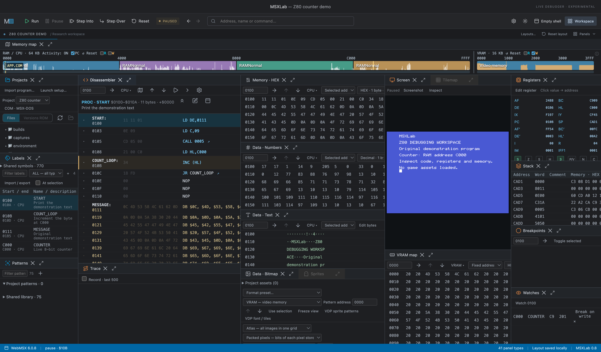
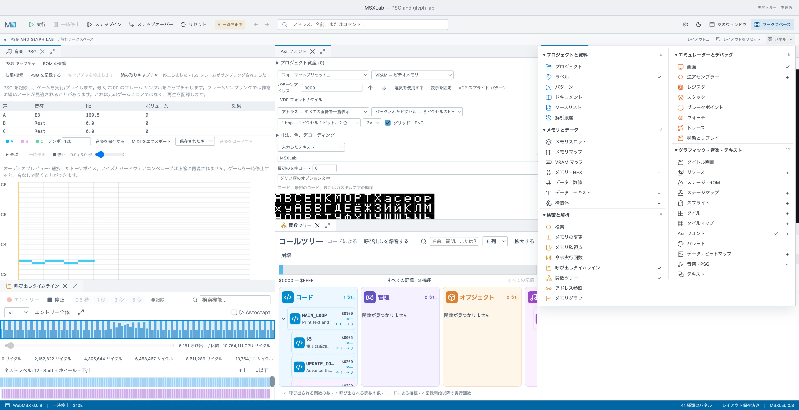

# MSXLab

[English](README.md) | **Русский**

Настольная лаборатория для запуска и исследования программ MSX. Приложение объединяет эмулятор, дизассемблер, просмотр памяти, графики и звука, разметку кода и инструменты поиска игровой логики.

**Инструмент для ИИ, исследующего и создающего программы MSX.** Одно из главных назначений MSXLab — дать ИИ-агенту прямое управление работающей лабораторией через API. Агент может исследовать память и код, управлять выполнением, проверять гипотезы, собирать трассы и сохранять результаты в разметке проекта. Вместе с инструментами редактирования исходников это позволяет выстроить повторяемый цикл исследования, создания и отладки MSX-программ с проверкой результата на эмулируемой машине.

Цель — на порядок повысить производительность и расширить возможности совместной работы человека и ИИ. Это ориентир развития, а не измеренная гарантия ускорения. Локальный HTTP API и мост MCP — центральная часть этого подхода; возможности и подключение описаны ниже в разделе автоматизации.

**Многоязычный интерфейс:** русский, английский, японский, португальский, нидерландский, испанский и китайский (упрощённый). Языковые пакеты охватывают меню, панели, настройки, подсказки и сообщения приложения. Подробнее — [покрытие перевода](docs/LANGUAGES.md).

MSXLab работает с реальным состоянием эмулируемой машины: позволяет остановить программу, посмотреть данные, выяснить, какая инструкция их изменила, и сохранить результаты исследования в проекте.

Это развивающееся приложение. Некоторые специализированные инструменты работают только с проверенными форматами данных; наличие просмотрщика не означает автоматическое распознавание ресурсов любой программы.



*Рабочая лаборатория на паузе в небольшой программе, написанной для этого снимка. Игровая графика и экраны сторонних программ не показаны.*

## Быстрый старт

На настроенном Mac откройте `Start MSXLab.command`. Повторный запуск поднимает существующее окно.

Проверенная среда — macOS, Node.js 23 и npm. Другие платформы пока не проверены. Для запуска нужен отдельно подключённый комплект движка и DOS. Если у вас есть доступ к MSXProjects, клонируйте его рядом с MSXLab и отдельно разместите локальную поставку WebMSX в MSXProjects/engines/webmsx-6.0.8 (она не входит ни в один репозиторий); подробнее — [структура репозиториев](docs/REPOSITORIES.md).

Из каталога MSXLab:

```sh
npm ci
node scripts/link-projects.mjs
npm run build
npm start
```

Для разработки: `npm run dev`. Обычный веб-просмотр не заменяет Electron: работа с локальными проектами требует desktop-моста.

1. Откройте проект в **Projects** и дождитесь загрузки.
2. Нажмите на экран эмулятора, чтобы передавать игре нажатия клавиш.
3. Используйте **Pause**, **Step Into**, **Step Over** и **Run** для исследования выполнения.
4. Откройте нужные инструменты через **Panels**.
5. Добавляйте имена и описания в **Labels** — они сохраняются в проекте.

Выбор адреса в просмотрщике сам по себе не меняет регистр PC. Reset и команды запуска воздействуют на машину.

## Возможности для пользователя

### Рабочее пространство

- Светлая и тёмная темы.
- Языковые пакеты: русский, английский, японский, португальский, нидерландский, испанский, китайский (упрощённый). Переведены меню, панели, настройки, подсказки и сообщения приложения; [покрытие перевода](docs/LANGUAGES.md).
- Перемещаемые панели, вкладки и дополнительные экземпляры просмотрщиков.
- Разворачивание панели в большое окно с возвратом на прежнее место.
- Подсветка панели при её повторном открытии, чтобы её было проще найти.
- Именованные раскладки и сохранение настроек основных панелей.

### Выполнение и отладка

- Пауза на границе инструкции, продолжение и пошаговое выполнение Z80.
- Проход вызова и выполнение до выбранного адреса.
- Точки останова, в том числе с простыми условиями по регистрам.
- Остановки по доступу к памяти и портам I/O; для VRAM — по записи.
- Регистры, флаги, стек, наблюдаемые значения и ограниченная трасса выполнения.
- Редактирование RAM, VRAM и регистров на паузе; отмена последней записи памяти с проверкой конфликта.

### Память, слоты и код

- HEX, текст и числовые представления памяти; закреплённый адрес или следование за выбранным адресом и регистрами.
- CPU-память, видеопамять и отдельные файлы проекта. CPU означает текущую карту адресов процессора, включая подключённые RAM и ROM.
- Компактная карта для выбора слота и подслота; обозначения разъёмов A/B и подсветка памяти, подключённой к CPU.
- Чтение поддерживаемых физических слотов и банков RAM без изменения подключения памяти игры.
- Отдельная панель **Слоты памяти** с окнами по 16 КБ и текущими подключениями.
- Дизассемблер Z80: код, код с данными, просмотр процедуры, имена операндов и переходы по адресам.
- Дизассемблирование выбранного файла с настраиваемым базовым адресом и смещением в файле.
- Метки, комментарии, диапазоны процедур и данных; импорт и экспорт разметки.

Файловое смещение и адрес CPU — разные величины. Базовый адрес файла нужно проверять, особенно у программ с загрузчиком, заголовками, переносом кода или банковой памятью. Поддержка чтения физических слотов зависит от типа устройства.

### Поиск и анализ

- Поиск чисел, текста и последовательностей байтов с маской.
- **Memory Changes**: сравнение состояний памяти, отбор изменившихся значений и сужение списка кандидатов.
- Имена известных переменных рядом с адресами; сведения о записавших инструкциях при включённом сборе соответствующих данных.
- Счётчики выполнения инструкций, дерево функций и хронология вызовов.
- Прямые ссылки на адреса, карты активности памяти, графики значений и схемы структур.

Статическое дерево и реальные записи выполнения решают разные задачи. Статический анализ не гарантирует обнаружение косвенных вызовов. Нулевой счётчик относится к периоду наблюдения, а не доказывает, что функция никогда не выполняется.

### Графика, звук и игровые ресурсы

- Экран эмулятора, PNG-снимки и исследование аппаратных спрайтов.
- Спрайты, тайлы, шрифты, палитра, битмапы и карты символов.
- Каталог описаний ресурсов **Assets**.
- Исследование SCREEN 2: коды символов, пиксельные маски, построчные цвета и сведения об исходных данных.
- Редактирование уровней для поддерживаемых форматов проекта; это не универсальный редактор уровней.
- PSG: просмотр регистров, запись звучания, piano roll и экспорт музыкальных данных.

Редактор уровней и восстановление заставок зависят от формата конкретной игры. Запись PSG отражает наблюдаемое звучание, а не восстанавливает исходную партитуру.

### Сохранение работы

- Автоматическое сохранение разметки проекта, история исследовательских изменений.
- Версии ROM и комплекты сборок; предупреждения о несовпадении разметки и программы.
- Профили запуска отдельно от раскладок панелей.
- Именованные состояния эмулятора с проверкой совместимости проекта, сборки и окружения.
- Экспериментальная запись и повтор ввода.

Состояние машины, версия ROM, исследовательская разметка и расположение панелей сохраняются раздельно. Восстановление машины не является откатом всех файлов проекта.

## Поддерживаемые форматы проектов

| Тип | Основные файлы | Как запускается |
| --- | --- | --- |
| ROM-картридж | `.rom`, `.mx1`, `.mx2` | Образ подключается к эмулируемой машине как картридж. |
| MSX-DOS | `.com` | Создаётся диск FAT12 720 КБ с MSX-DOS 1; программа запускается как `APP.COM`. Можно добавить сопровождающие файлы. |
| MSX BASIC | `.bas` | Создаётся диск с программой и выполняется автоматический RUN. |
| Программа с загрузчиком | Родной BASIC-загрузчик, в том числе токенизированный, и набор файлов | Загрузчик запускается под своим именем и сам определяет порядок загрузки, перенос кода и размещение модулей. |
| Демонстрационный | Внутренний Mock backend | Имитация для демонстрации интерфейса; это не исполнение реальной программы MSX. |

**Первичное создание проекта из файла** принимает `.rom`, `.mx1`, `.mx2`, `.com`, `.bas`. Режим «Программа с загрузчиком» настраивается в выборе типа проекта: указываются загрузчик, модель машины и сопровождающие файлы.

`.OBJ`, `.BIN` и другие модули могут быть сопровождающими файлами загрузчика. Само расширение не определяет, куда и как их нужно загружать. Например, несколько модулей могут загружаться по одному адресу и затем переносить себя в другие области памяти.

- На диске используются имена DOS 8.3; сопровождающие файлы загрузчика сохраняют свои имена.
- В настройках доступны MSX1E, MSX1J, MSX2E и MSX2J. Требования самой программы к BIOS, памяти и периферии сохраняются.
- Можно подключить дополнительный ROM, выбрать файлы DOS и настроить команду запуска.
- Дисковый образ используется как часть окружения. Произвольный `.dsk` не является отдельным типом прямого импорта проекта.
- Прямой импорт кассет `.cas`, архивов `.zip` и произвольных состояний сторонних эмуляторов этим списком не предусмотрен.

Проект хранится в `projects/<id>/project.json`. В зависимости от проекта рядом находятся `program`, `environment`, `builds`, `research`, `resources`, `captures` и `sessions`. Исходные программы копируются в проект; подготовленные комплекты запуска сохраняются с контрольными суммами.

## Необязательные функции ИИ

Подключите собственного поставщика Chat Completions в **Настройки → ИИ**: адрес API, модель и свой ключ. По умолчанию ИИ выключен; аккаунт и ключ автора не входят в поставку. См. [короткую инструкцию и состав передаваемых данных](docs/AI.ru.md).

## Удалённое управление и интеграция с помощником

Приложением можно управлять программно через **локальный HTTP API**. В репозитории также есть **stdio MCP-мост** для подключения к совместимому клиенту.

Это управление уже запущенным MSXLab на том же компьютере. Сетевой доступ с другого компьютера отдельно не настроен.

### Что доступно через API

| Задача | Команды |
| --- | --- |
| Узнать состояние и проекты | `status`, `projects`, `apiCapabilities` |
| Загрузить и настроить запуск | `loadProject`, `createProject`, `updateBuild`, `configureLaunch`, `launchProfile` |
| Перезапустить | `reset`, `restartProject` |
| Отметить исходное состояние и вернуться | `markInitialState`, `restoreInitialState` |
| Сохранить полный снимок машины | `saveCheckpoint`, `listCheckpoints`, `restoreCheckpoint` |
| Управлять выполнением | `run`, `pause`, `step`, `stepOver`, `until`, `runFor`, `runUntil` |
| Читать память, слоты и код | `readMemory`, `readSlots`, `readSlotMemory`, `registers`, `readDisassembly`, `readReferences` |
| Искать и сравнивать | `searchMemory`, `rememberState`, `compareState` |
| Узнать содержимое панелей | `listPanels`, `readPanel` |
| Получить изображения | `capture` — сохранить экран; `captureImage` — вернуть PNG экрана или изображения из панели |
| Работать с исследованием | `readLabels`, `upsertLabels`, `undoResearch`, `setBreakpoints`, `setWatchpoints` |
| Изменять данные и собирать трассу | `writeMemory`, `setRegister`, `trace`, `readTrace` |

### Подключение по HTTP

После запуска приложение создаёт `.msxlab-runtime.json` с локальным адресом API и токеном. Порт не следует фиксировать вручную. Токен передаётся в заголовке `Authorization: Bearer …`.

Тело POST-запроса:

```json
{
  "command": "readMemory",
  "args": { "space": "cpu", "address": 57536, "length": 8 }
}
```

Этот пример читает восемь байтов с адреса `$E0C0`. Числа в JSON — десятичные. Ответ HTTP содержит `result`, при ошибке — `error`. Новые команды обычно дополнительно указывают проект, сессию, время ответа и характер действия.

Файл с токеном не предназначен для публикации. Команды чтения не изменяют данные игры; команды исполнения, записи и восстановления состояния могут их менять.

### Подключение через MCP

Запустите приложение, затем настройте клиент на запуск:

```sh
node /absolute/path/to/MSXLab/scripts/mcp.mjs
```

Мост передаёт запросы в тот же локальный HTTP API. Его фактический список инструментов возвращается через `tools/list`.

**Покрытие HTTP и MCP пока различается:** новые команды из `docs/automation-api.md` добавлены в HTTP API, но ещё не зарегистрированы в `scripts/mcp.mjs`. Настройка клиента и установка подключения автоматически не выполняются.

### Что важно учитывать

- «Исходное состояние» отмечается явно после нужного момента загрузки; приложение не угадывает его автоматически.
- `readPanel` возвращает отрисованные элементы панели, а не полную модель скрытых данных. Неоткрытые панели могут отсутствовать.
- `captureImage` экспортирует canvas/изображение или его фрагмент; это не универсальный снимок любой панели целиком.
- `compareState` сравнивает CPU-видимую память, VRAM, регистры и подключения. Отключённые банки RAM не входят в это сравнение.
- `runUntil` поддерживает адрес, запись в память и время. События переключения слота и появления картинки пока не реализованы.
- `undoResearch` отменяет последнее API-изменение меток и отказывается работать при последующих конфликтующих правках. Это не общий откат проекта.
- Возможности в этом README описывают исходники. Уже открытая старая сборка может не иметь новых команд до обновления приложения.

Полные аргументы, ограничения и примеры поведения новых команд: [локальный API автоматизации](docs/automation-api.md).

### Анализ в японском интерфейсе



*Светлая тема с раскрытым списком панелей. Показаны собственная программа тестового звука и образцы нашего шрифта; запись PSG и хронология вызовов получены при её выполнении.*

## Дополнительная документация

- [Графические ресурсы](docs/ASSETS.md)
- [Музыка и PSG](docs/MUSIC.md)
- [Активность памяти](docs/ACTIVITY.md)
- [Кодировки текста](docs/TEXT-CHARSETS.md)
- [ИИ-функции](docs/AI.ru.md)

## Разработка и проверка

Стек: Electron, React, TypeScript, Dockview; эмуляция через адаптер WebMSX.

```sh
npm run typecheck
node tests/automation-api.mjs
npm run build
```

Первая команда проверяет типы, вторая — логику расширенного API на тестовых данных, третья собирает интерфейс. Эти проверки сами по себе не подтверждают совместимость каждой MSX-программы. Интеграционные тесты находятся в `tests` и `scripts`; перед их запуском следует учитывать, какие проекты и файлы они создают.

## Репозитории

Исходники лаборатории и пользовательские проекты разделены. См. [подключение MSXProjects](docs/REPOSITORIES.md).

## Участие и лицензирование

Порядок изменений: [CONTRIBUTING.md](CONTRIBUTING.md). Сторонние компоненты: [THIRD_PARTY.md](THIRD_PARTY.md). **Разрешено некоммерческое использование**, включая копирование, изменение и распространение, с сохранением авторства и обязательной ссылки **https://github.com/Andrey-Dymov/MSXLab**. Коммерческое использование требует отдельного разрешения автора. Полные условия — в [лицензии](LICENSE). На сторонние компоненты эта лицензия не распространяется.
